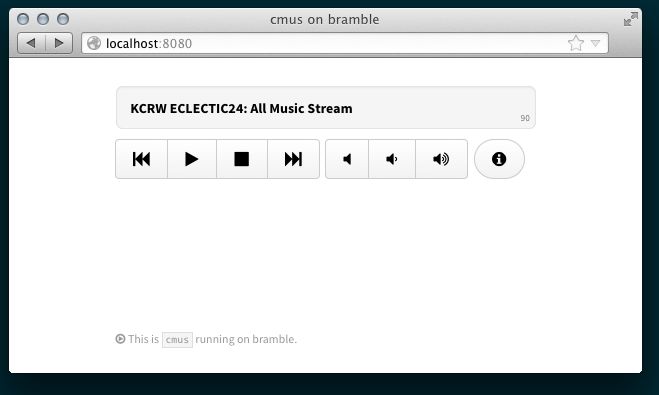

# cmus-remote web app

This is a web app to control a server instance of
[`cmus`](https://cmus.github.io/), a powerful music player, remotely. It only
supports basic player and volume controls, not adding items to the playlist. 

## Dependencies

`cmus` is required, of course. The backend is written in Python and has been
tested with Python 2.7, Python 3.5, PyPy 4.0, and Pyston 0.4.

All dependencies are bundled. They are [`bottle`](http://bottlepy.org) and
[`sh`](http://amoffat.github.com/sh/). The frontend also makes use of
[Zepto](http://zeptojs.com/), [Kube](http://imperavi.com/kube), and [Font
Awesome](http://fortawesome.github.com/Font-Awesome/). Thanks to the creators
for making them available under permissive licenses. 

## Instructions

The web app can run on the same host as the `cmus` instance you want to control
or a different one, but both hosts will have to have `cmus` installed.

### On the cmus host

- Run an instance of `cmus` using the `--listen` option.

        $ cmus --listen <host>

- Set a password in `cmus` using `:set passwd=<passwd>`.

### On the web app host

- Fetch cmus_app:

        $ git clone git://github.com/jboynyc/cmus_app
        $ cd cmus_app

- Edit the configuration file. (Optional.)
- Run the app with a configuration file or command-line options:

        $ python app.py -f <config_file>
        $ python app.py -c raspberry -w PaSsWd -a localhost -p 8080

### Anywhere on your network

- Open your browser and navigate to `http://<host>:<port>`.

Enjoy!

## Prior Art and Alternatives

Take a look on the [cmus wiki](https://github.com/cmus/cmus/wiki/remote-control).
